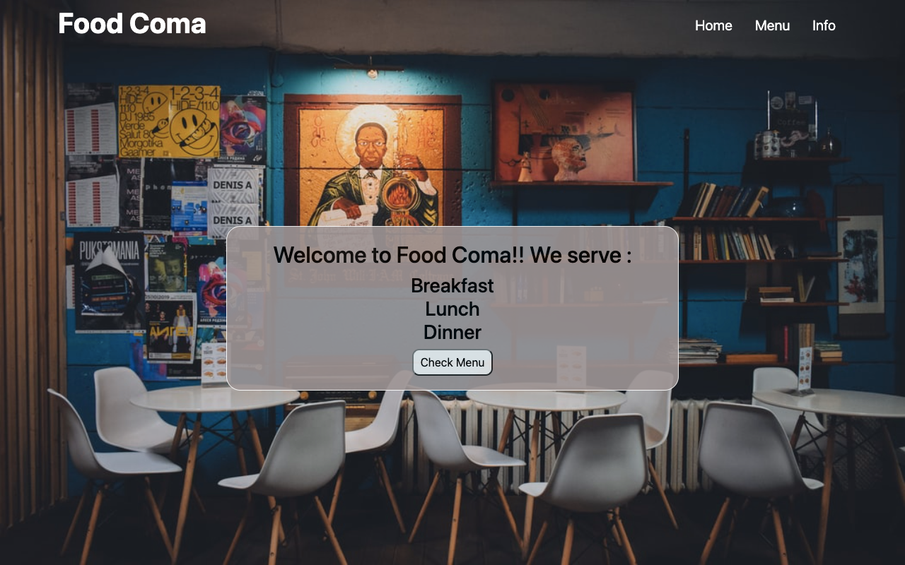

# Restaurant-page

> The website is built using Javascript and Webpack. The website has three tabs in the navbar that navigates to the three sections of the website : home, menu and info. The home tab navigates to the website home page, the menu tab displays the restaurant menu and the info tab displays the contact information of the restaurant and a form as well. The form can be submitted to the website with foloowing information: name, email and location.

## Built With

- Javascript
- Bootstrap
- HTML and CSS

## Live Demo

[Live Demo Link](https://github.com/jrai0792/Restaurant-page.git)

## Getting Started

To get a local copy up and running follow these simple example steps.

1. Navigate to the folder where you want to want to clone the repository and run git clone https://github.com/jrai0792/Restaurant-page
2. cd Restaurant-page
3. npm install

## Authors

👤 **Jyoti Rai**

- GitHub: [@githubhandle](https://github.com/jrai0792)
- Twitter: [@twitterhandle](https://twitter.com/jyotirai0792)
- LinkedIn: [LinkedIn](https://linkedin.com/rai-jyoti)

## Show your support

Give a ⭐️ if you like this project!

## 📝 License

This project is [MIT](lic.url) licensed.